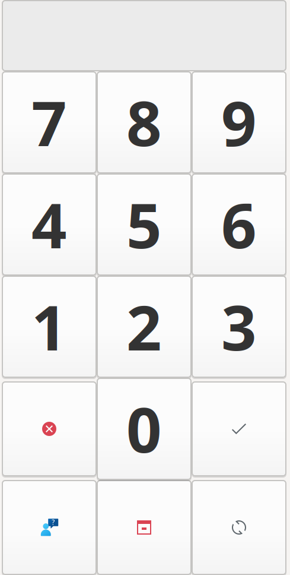

# RDP Greeter (e.g. for LightDM) for Thin Client

Показывает простую страницу с пин-кодом. Если пин-код правильный - запускает сеанс RDP к серверу.
Серверы описаны в конфигурационном [файле](config.json).

Основано на https://habr.com/ru/articles/420099/, там же описан процесс настройки тонкого клиента.

---

Shows a simple page with pincode, if pincode is correct - run RDP session to server.
Servers are described in config [file](config.json).

Based on this [article (link to auto translation)](https://habr-com.translate.goog/ru/articles/420099/?_x_tr_sl=ru&_x_tr_tl=en&_x_tr_hl=en&_x_tr_pto=wapp&_x_tr_hist=true), the process of setting up a thin client is also described there.

### Dependencies
Установка зависимостей описана [тут](https://pygobject.readthedocs.io/en/latest/getting_started.html), только замените 4.0 на 3.0.

How to install dependencies is described [here](https://pygobject.readthedocs.io/en/latest/getting_started.html), but you need to change 4.0 to 3.0.

Example:

`sudo apt install python3-gi python3-gi-cairo gir1.2-gtk-3.0`

### Theme, icons, cursors

Theme and icons:
```
cat ~/.config/gtk-3.0/settings.ini
[Settings]
gtk-application-prefer-dark-theme=false
gtk-button-images=true
gtk-cursor-theme-name=Numix
gtk-icon-theme-name=whiteglass
gtk-theme-name=Numix
```

Обязательно установите поддержку значков SVG:

Be sure to install SVG icons support:

`sudo apt install librsvg2-common`

Настройка курсоров:

Configure cursors:

`sudo update-alternatives --config x-cursor-theme`


### Screenshot

