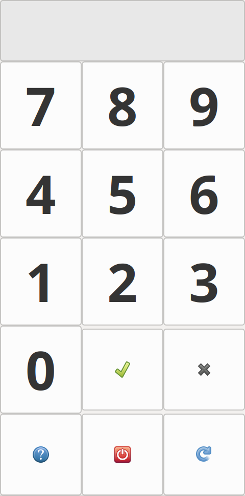

# RDP Greeter (e.g. for LightDM) for Thin Client

Показывает простую страницу с пин-кодом. Если пин-код правильный - запускает сеанс RDP к серверу.
Серверы описаны в конфигурационном [файле](config.json).

Основано на https://habr.com/ru/articles/420099/, там же описан процесс настройки тонкого клиента.

Установка зависимостей описана [тут](https://pygobject.readthedocs.io/en/latest/getting_started.html).

---
Shows a simple page with pincode, if pincode is correct - run RDP session to server.
Servers are described in config [file](config.json).

Based on this [article (link to auto translation)](https://habr-com.translate.goog/ru/articles/420099/?_x_tr_sl=ru&_x_tr_tl=en&_x_tr_hl=en&_x_tr_pto=wapp&_x_tr_hist=true), the process of setting up a thin client is also described there.

How to install dependencies is described [here](https://pygobject.readthedocs.io/en/latest/getting_started.html).

### Screenshot

